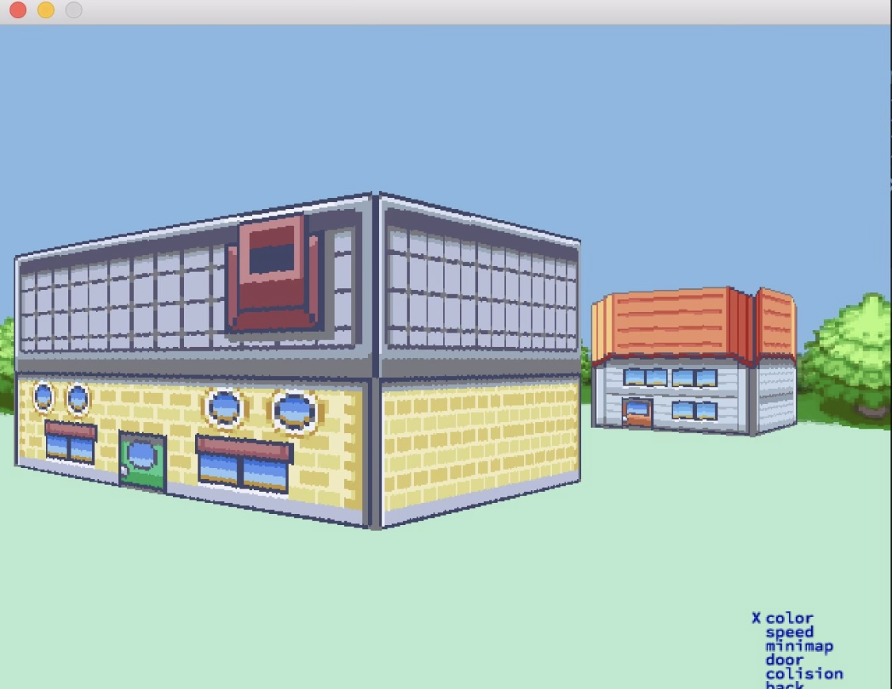

# Cub3D

Cub3D is a simple 3D game engine developed in C using raycasting to render a basic 3D world, inspired by classic first-person shooters like 'Wolfenstein 3D' and 'Doom'.



## Description

Cub3D is a project that demonstrates the use of raycasting to render a 3D environment. It includes basic game mechanics such as player movement, camera rotation, and wall rendering. The goal is to create a playable 3D world with minimal resources, focusing on learning low-level graphics programming in C.

## Features

- **Raycasting Engine**: Renders a 3D environment with walls and floors.
- **Player Movement**: Allows the player to move around the world and look around using keyboard and mouse input.
- **Simple Map**: A basic map layout with walls and open spaces.
- **Camera Rotation**: Supports 2D and 3D camera rotation to navigate the environment.

## Installation

To install and run Cub3D, follow these steps:

### Steps

1. Clone the repository:

   ```bash
   git clone 'https://github.com/your-username/cub3d.git'
   cd cub3d
   ```

2. Compile the project:

   ```bash
   make bonus
   ```

3. Run the game:

   ```bash
   ./cub3D_bonus assets/maps/mapokemon.cub
   ```

   Replace 'map.cub' with the path to your map file.

## Usage

- **WASD keys**: Move the player forward, backward, and side to side.
- **Arrow keys / Mouse**: Rotate the camera to look around.
- **Esc**: Exit the game.

## Map Format

The map file (.cub) should consist of a grid of characters representing the layout of the 3D world. Example:

```
111111
100001
101101
100001
111111
```

Where '1' represents a wall and '0' represents an open space.

## Contributing

Feel free to fork the repository and create a pull request. Contributions are welcome, especially improvements to the game engine and additional features.

## Acknowledgements

- Inspired by classic first-person shooters like 'Wolfenstein 3D' and 'Doom'.
- Uses **MinilibX** for graphics rendering (a simple graphics library for X11).
